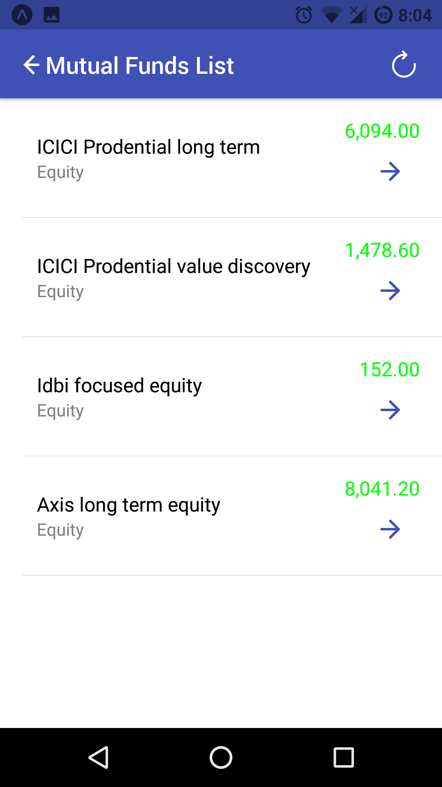
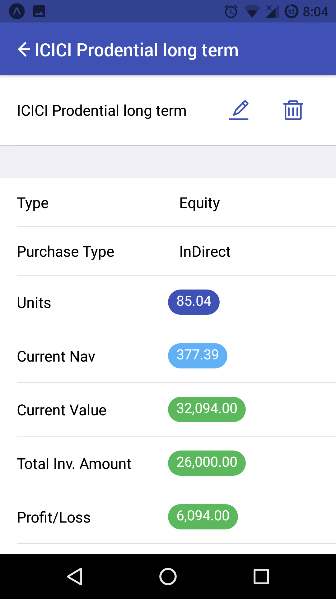
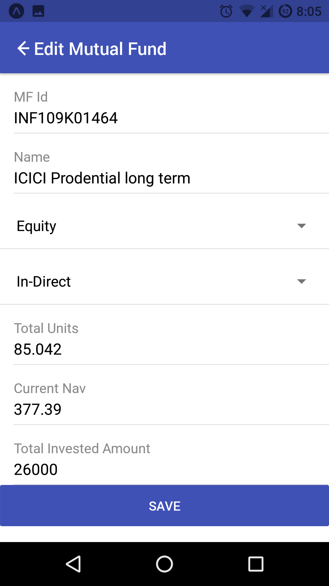

# Track Direct Mutual Funds
This project is for to check the current nav price of mutual funds those are purchased directly from website ie. not from broker/angency

## Technologies
* React Native
* Native Base
* Expo
* Firebase
* Open API to fetch MF Data

## Expo (Live)
Scan to open appplication

## Screenshots

#### Pending task
* Add SIP Feature
* Store login data in sesionstoare 
* Styling ot layout fixes
* Generic toast message service
* Send email verification
* Forget password
* User Profile
* Back button navigation should not navigate to login page
